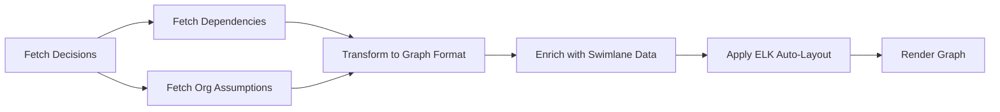

# Decision Flow Graph - Enhanced with Swimlane Auto-Layout

## Overview

An advanced React Flow visualization that displays decision relationships, organizational assumptions, and dependencies with **automatic swimlane-based layout** powered by ELKjs.

## 🚀 Key Features

### **Automatic Swimlane Layout**
- ✅ **ELKjs-powered auto-layout** - No manual node positioning required
- ✅ **Horizontal Left-to-Right flow** - Natural reading direction (Inputs → Decisions → Outcomes)
- ✅ **Category-based swimlanes** - Decisions auto-organized into Strategy, Technical, Operations, Compliance, Financial rows
- ✅ **Clean orthogonal edges** - Professional right-angle connections

### **Decision & Assumption Visualization**
- ✅ **Decision nodes** - Enhanced card design with status badges, health indicators, and glow effects
- ✅ **Organizational assumption nodes** - Circular nodes showing assumptions affecting multiple decisions
- ✅ **Decision-specific assumptions** - Revealed in detail panel when clicking a decision
- ✅ **Interactive highlighting** - Click assumptions to highlight connected decisions

### **Professional Design**
- ✅ **At-Risk indicator** - Red glowing border + pulse animation for decisions needing attention
- ✅ **Health signals** - Color-coded dots (green/yellow/orange/red) showing decision health
- ✅ **Status badges** - Clear visual indicators (Stable, Under Review, At Risk, Invalidated, Retired)
- ✅ **Category labels** - Shows decision type/domain

## Architecture

### Components

1. **index.jsx** - Main graph component
   - Fetches data from backend APIs
   - Applies ELK auto-layout algorithm
   - Manages node/edge state
   - Handles click interactions
   - Renders swimlane labels

2. **DecisionNode.jsx** - Enhanced decision card node
   - Professional card design with visual hierarchy
   - Status badges with icons
   - Health indicators (0-100%)
   - Category/type labels
   - Glowing borders for at-risk decisions
   - Multiple connection handles (left, right, top, bottom)

3. **OrgAssumptionNode.jsx** - Organizational assumption node
   - Circular design
   - Status-based coloring (VALID/SHAKY/BROKEN)
   - Highlights on click

4. **DecisionDetailPanel.jsx** - Right-side detail panel
   - Opens when clicking a decision node
   - Shows organizational AND decision-specific assumptions
   - Clearly separated sections

## Graph Elements

### Nodes

- **Decision nodes**: Enhanced rectangular cards with:
  - Status badge (top)
  - Category label
  - Health indicator
  - Title and description
  - Glowing effect for at-risk decisions
  
- **Organizational assumption nodes**: Circular nodes showing:
  - Short label
  - Status color (green/yellow/red)
  - Highlight effect on click

### Edges

- **Decision → Decision**: Solid blue arrows with smooth steps (dependencies)
- **Org Assumption → Decision**: Dotted purple lines (supporting context)

## Swimlane Organization

Decisions are automatically organized into swimlanes based on their `metadata.category`:

| Category | Swimlane | Color | Use Case |
|----------|----------|-------|----------|
| Strategy/Strategic | **Strategy** | Blue | High-level business decisions |
| Technical/Tech/Engineering | **Technical** | Purple | Technology & architecture |
| Operations/Ops | **Operations** | Cyan | Process & operations |
| Compliance/Legal/Regulatory | **Compliance** | Green | Legal & regulatory |
| Financial/Budget/Finance | **Financial** | Orange | Budget & finance |
| *Other* | **Other** | Gray | Uncategorized |

### Adding Category to Decisions

When creating decisions, include category in metadata:

```javascript
{
  title: "Adopt Cloud Strategy",
  metadata: {
    category: "Strategy"  // ← This determines swimlane placement
  }
}
```

## Data Flow



### API Endpoints Used

1. **GET /api/decisions** - Fetches all decisions
2. **GET /api/dependencies/:id** - Fetches decision dependencies
3. **GET /api/assumptions** - Fetches organizational assumptions (scope=UNIVERSAL)
4. **GET /api/assumptions/:decisionId** - Fetches assumptions for specific decision (on click)

## Usage

### Click Interactions

1. **Click a DECISION node**:
   - Opens detail panel on right
   - Shows organizational assumptions
   - Shows decision-specific assumptions
   - Both types clearly separated

2. **Click an ORG ASSUMPTION node**:
   - Highlights all connected decisions
   - Click again to unhighlight
   - Does NOT open detail panel

3. **Refresh button** (top-right):
   - Reloads graph data
   - Re-applies layout
   - Updates all nodes/edges

## Layout Configuration

The auto-layout can be customized in `index.jsx`:

```javascript
await applySwimLaneLayout(decisionNodes, graphEdges, {
  nodeWidth: 280,           // Card width
  nodeHeight: 120,          // Card height  
  swimlaneSpacing: 180,     // Vertical space between swimlanes
  stageSpacing: 400,        // Horizontal space between columns
  nodeSpacing: 60,          // Space between nodes in same lane
});
```

## File Structure

```
DecisionFlowGraph/
├── index.jsx                    # Main component (enhanced with swimlane layout)
├── DecisionNode.jsx             # Enhanced decision card node
├── OrgAssumptionNode.jsx        # Circular assumption node
├── DecisionDetailPanel.jsx      # Right-side detail panel
├── styles.css                   # Custom styles
├── README.md                    # This file
├── SWIMLANE_GUIDE.md           # Detailed swimlane implementation guide
├── VICTORY_SUMMARY.md          # Feature summary
└── QUICK_REFERENCE.md          # Quick reference guide
```

## Key Improvements from Original

### Before (Original DecisionFlowGraph):
- ❌ Manual vertical layout
- ❌ No swimlane organization
- ❌ Basic node styling
- ❌ No category support

### After (Enhanced with Swimlane):
- ✅ Automatic ELK-powered layout
- ✅ Swimlane organization by category
- ✅ Professional card design with glow effects
- ✅ Health indicators and status badges
- ✅ Horizontal left-to-right flow
- ✅ Clean orthogonal edges
- ✅ **Still maintains all assumption connections and interactions**

## Why This Merge?

The original DecisionFlowGraph and SwimlaneDagFlow had overlapping functionality:
- Both visualized decisions and dependencies
- Both used React Flow
- Having two pages was redundant

**Solution**: Merge the best of both into a single, powerful component that:
- Keeps the valuable assumption connections from the original
- Adds the professional swimlane auto-layout from SwimlaneDagFlow
- Provides one unified, feature-rich view

## Technical Details

### ELK Layout Algorithm
- **Algorithm**: `layered` (hierarchical layout)
- **Direction**: `RIGHT` (left-to-right flow)
- **Edge Routing**: `ORTHOGONAL` (clean right angles)
- **Swimlane Implementation**: Uses partition-based node grouping

### Assumption Positioning
Organizational assumption nodes are positioned on the left side (-350px) with vertical spacing, separate from the ELK layout of decision nodes. This ensures they don't interfere with the swimlane organization.

### Performance
- Layout calculation: ~100-500ms for 50-100 nodes
- React.memo() used on nodes to prevent unnecessary re-renders
- Efficient data fetching with parallel API calls

## Troubleshooting

### Q: Decisions not organized into swimlanes?
**A**: Ensure decisions have `metadata.category` set. Check the category value matches expected values (Strategy, Technical, etc.)

### Q: Layout looks cluttered?
**A**: Adjust spacing parameters in the `applySwimLaneLayout` call in `index.jsx`

### Q: Assumption nodes overlap with decisions?
**A**: Assumption nodes are intentionally positioned on the left (-350px). If still overlapping, increase the negative x value.

### Q: Edges look messy?
**A**: ELK's orthogonal routing works best with horizontal layouts. Ensure decisions have proper dependencies defined.

## Future Enhancements

Potential additions (not yet implemented):
- [ ] Stage column indicators (Inputs, Decisions, Outcomes)
- [ ] Toggle swimlane visibility
- [ ] Collapsible swimlane sections
- [ ] Search and highlight feature
- [ ] Export as PNG/SVG
- [ ] Real-time updates via WebSocket

## Related Documentation

- [SWIMLANE_GUIDE.md](./SWIMLANE_GUIDE.md) - Complete implementation details
- [VICTORY_SUMMARY.md](./VICTORY_SUMMARY.md) - Feature list and usage
- [QUICK_REFERENCE.md](./QUICK_REFERENCE.md) - Quick start guide

---

**Enhanced Decision Flow Graph - The best of both worlds! 🚀**

### APIs Used

```javascript
// Fetch all decisions
GET /decisions

// Fetch all assumptions (filtered by scope)
GET /assumptions

// Fetch assumptions for specific decision
GET /assumptions?decisionId=X

// Fetch dependencies for a decision
GET /dependencies?decisionId=X
```

### Data Transformation

1. Backend returns normalized relational data (IDs, foreign keys)
2. Frontend transforms into React Flow format:
   ```javascript
   {
     nodes: [
       { id: 'decision-123', type: 'decision', position: {x, y}, data: {...} },
       { id: 'org-assumption-456', type: 'orgAssumption', position: {x, y}, data: {...} }
     ],
     edges: [
       { source: 'decision-123', target: 'decision-789', type: 'default' },
       { source: 'org-assumption-456', target: 'decision-123', style: { strokeDasharray: '5,5' } }
     ]
   }
   ```

## User Interactions

### Click a Decision Node

1. Opens right-side detail panel
2. Fetches assumptions via `GET /assumptions?decisionId=X`
3. Separates by scope:
   - `scope === 'UNIVERSAL'` → Organizational assumptions
   - `scope === 'DECISION_SPECIFIC'` → Decision-specific assumptions
4. Displays both sections clearly

### Click an Org Assumption Node

1. Highlights all connected decisions
2. Does NOT open detail panel
3. Click again to un-highlight

## Integration with Your App

### Step 1: Import the Component

```jsx
import DecisionFlowGraph from "./components/DecisionFlowGraph";
```

### Step 2: Use in Your Dashboard

```jsx
function Dashboard() {
  return (
    <div className="h-screen">
      <DecisionFlowGraph />
    </div>
  );
}
```

### Step 3: Ensure API Service Exists

The component uses `api.js` service which should have:

- `getDecisions()`
- `getAssumptions(decisionId, includeConflicts)`
- `getDependencies(decisionId)`

### Step 4: Backend Requirements

Your backend must:

- Filter data by `organizationId` (from authenticated user)
- Return assumptions with `scope` field ('UNIVERSAL' or 'DECISION_SPECIFIC')
- Support querying linked assumptions via `decision_assumptions` junction table

## Database Schema Requirements

```sql
-- Decisions table
CREATE TABLE decisions (
  id UUID PRIMARY KEY,
  title TEXT NOT NULL,
  description TEXT,
  lifecycle TEXT CHECK (lifecycle IN ('STABLE', 'UNDER_REVIEW', 'AT_RISK', 'INVALIDATED', 'RETIRED')),
  organization_id UUID NOT NULL
);

-- Assumptions table with scope
CREATE TABLE assumptions (
  id UUID PRIMARY KEY,
  description TEXT NOT NULL,
  status TEXT CHECK (status IN ('VALID', 'SHAKY', 'BROKEN')),
  scope TEXT CHECK (scope IN ('UNIVERSAL', 'DECISION_SPECIFIC')) DEFAULT 'UNIVERSAL',
  organization_id UUID NOT NULL
);

-- Junction table for many-to-many relationship
CREATE TABLE decision_assumptions (
  decision_id UUID REFERENCES decisions(id),
  assumption_id UUID REFERENCES assumptions(id),
  PRIMARY KEY (decision_id, assumption_id)
);

-- Dependencies table
CREATE TABLE dependencies (
  id UUID PRIMARY KEY,
  source_decision_id UUID REFERENCES decisions(id),
  target_decision_id UUID REFERENCES decisions(id)
);
```

## Features

✅ Graph visualization with React Flow
✅ Custom node types (decisions + org assumptions)
✅ Edge types (solid arrows for dependencies, dotted lines for assumptions)
✅ Click decision → see org + decision-specific assumptions
✅ Click org assumption → highlight connected decisions
✅ Fetches real data from backend APIs
✅ No mocked business logic or authentication
✅ Responsive design with mini-map and controls

## Customization

### Layout

Currently uses simple vertical layout. To customize:

```javascript
// In transformDataToGraph()
decisions.forEach((decision, index) => {
  graphNodes.push({
    position: { x: 250, y: index * 200 }, // Change this
    ...
  });
});
```

Consider using:

- Dagre for automatic hierarchical layout
- Force-directed layout for organic clustering
- Custom algorithm based on dependencies

### Styling

- Edit `DecisionNode.jsx` for decision appearance
- Edit `OrgAssumptionNode.jsx` for assumption appearance
- Edit `styles.css` for animations and effects

### Additional Features

- Add filtering by lifecycle status
- Add search functionality
- Add zoom to node on select
- Add automatic layout algorithms
- Add export to image

## Performance Considerations

For large graphs (100+ nodes):

- Consider pagination or filtering
- Implement virtual rendering
- Add loading states for individual fetches
- Optimize re-renders with React.memo

## Troubleshooting

**Problem**: Assumptions not showing in detail panel

- Check that assumptions have `scope` field populated
- Verify `decision_assumptions` junction table has links
- Check console logs for API response structure

**Problem**: Dependencies not showing as edges

- Ensure backend returns dependencies for each decision
- Check that decision IDs match in dependencies table
- Verify graph transformation logic

**Problem**: Layout looks cramped

- Adjust `position` values in `transformDataToGraph()`
- Use `fitViewOptions` padding parameter
- Implement automatic layout algorithm

## Next Steps

1. ✅ Install React Flow: `npm install @xyflow/react`
2. ✅ Create custom nodes
3. ✅ Create main graph component
4. ✅ Create detail panel
5. ✅ Implement data fetching
6. ✅ Add click handlers
7. 🔲 Integrate into your main app
8. 🔲 Test with real backend data
9. 🔲 Add automatic layout (optional)
10. 🔲 Add filtering/search (optional)
